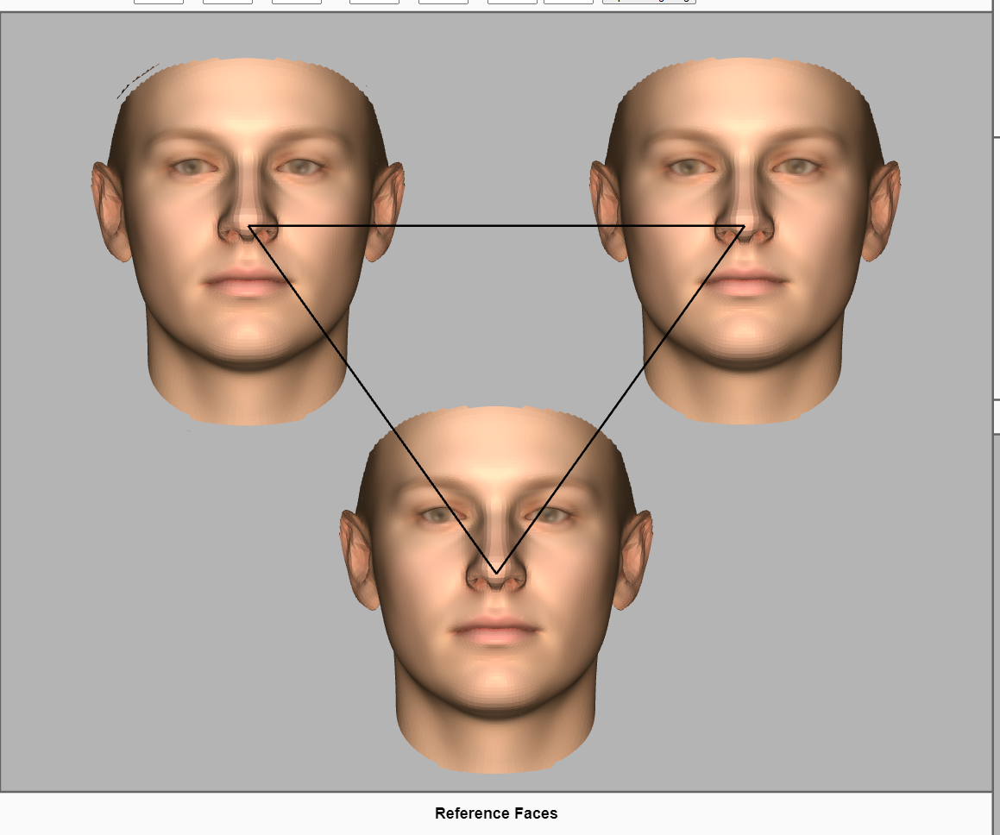
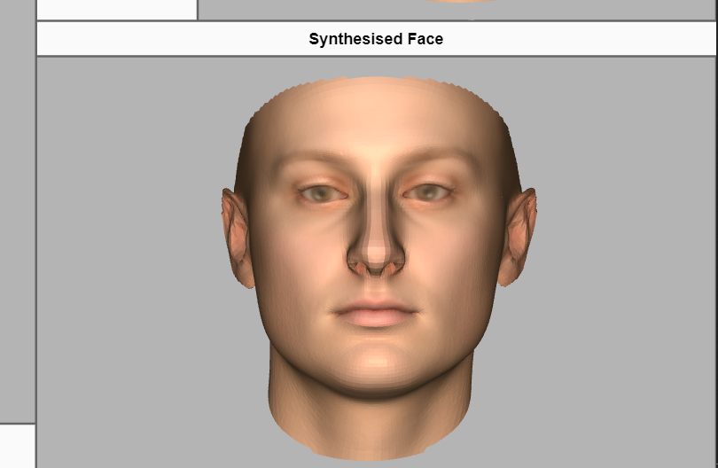
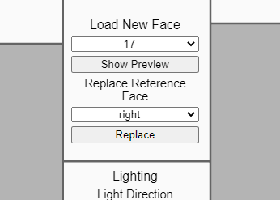
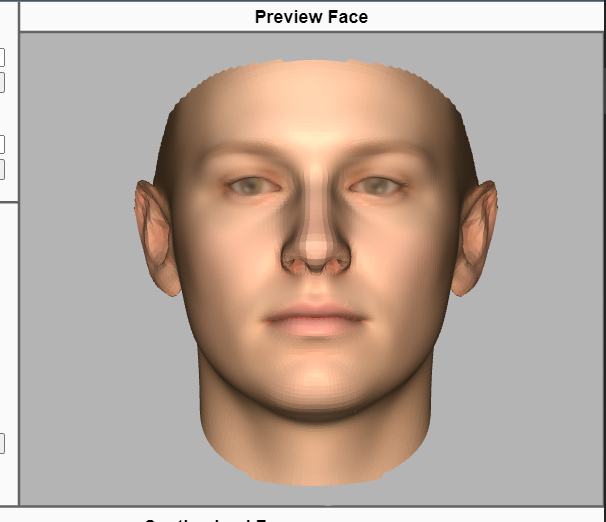
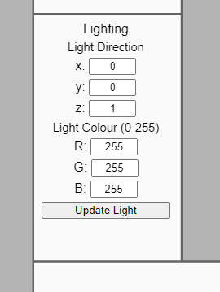
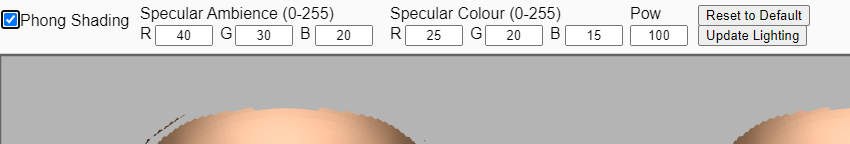

# READ ME

@import "style.less"

## Running the Application

1. Run "run.sh" (if running from the command line, make sure you run it from within its directory). This will start the web server for the application.

2. Your web browser will now open, containing the application. You should see "Loading..." text while it loads the data, then the application will run.

3. To close the application properly, make sure you stop the "run.sh" script, otherwise the web server will continue to run in the background.

## Application Usage

The basic usage is to click within the triangle on the left side, which chooses a proportion of the three displayed faces to use to synthesise a new face (displayed bottom right). Each of the three faces can be replaced by a new face in the "Load New Face" menu, where you can use the drop-downs to select which face to load, and which reference face to replace. A preview can be shown to the right of the menu by clicking "Show Preview", and the chosen reference face can be replaced with the "Replace" button.

The interpolation triangle

The synthesised face

The "Load New Faces" menu

The preview face

* Note: Upon replacing a face, the contribution of the replaced face is "locked in" until that face is loaded again and a new contribution is set. Because of this, defining contributions for a large number of faces my result

Additionally, you can control the lighting used for the faces. In the top left, there is a checkbox to toggle Phong shading on (the default is Lambertian). While Phong shading is toggled on, you can adjust the parameters of the shading model. You can also adjust the light direction and colour in the "Lighting" menu below the "Load New Face" menu.

The lighting menu

The phong menu

* Note: Application is designed to be used in a full-size window. While elements will scale to match a resized window, UI elements may not scale or position correctly.

## Source Code

The source code consists of the ".js" files located directly in the "src" folder. Also located in "src" is the "data" folder, containing the unpacked data zip, and the "libraries" folder, containing the "p5.js" library which is used to help render to the canvas. The non-js files in the "src" folder combine the source code into a single web page to create the application.

### Source Code Files

* `sketch.js`: Core code of the file. contains the setup functions and draw loop. All other functions start from calls made here.

* `load.js`: Helper functions for loading and pre-processing the data

* `render.js`: Code for rendering faces

* `phong.js`: UI elements to control the Phong shader

* `selector.js`: UI elements to control loading a new face as a preview or replacing a reference face

* `synth.js`: Face synthesis, handling user input to define face synthesis

* `UI.js`: Miscellaneous screen elements, and the controls for light direction and colour
